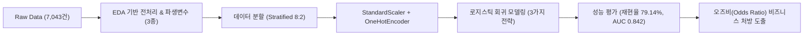
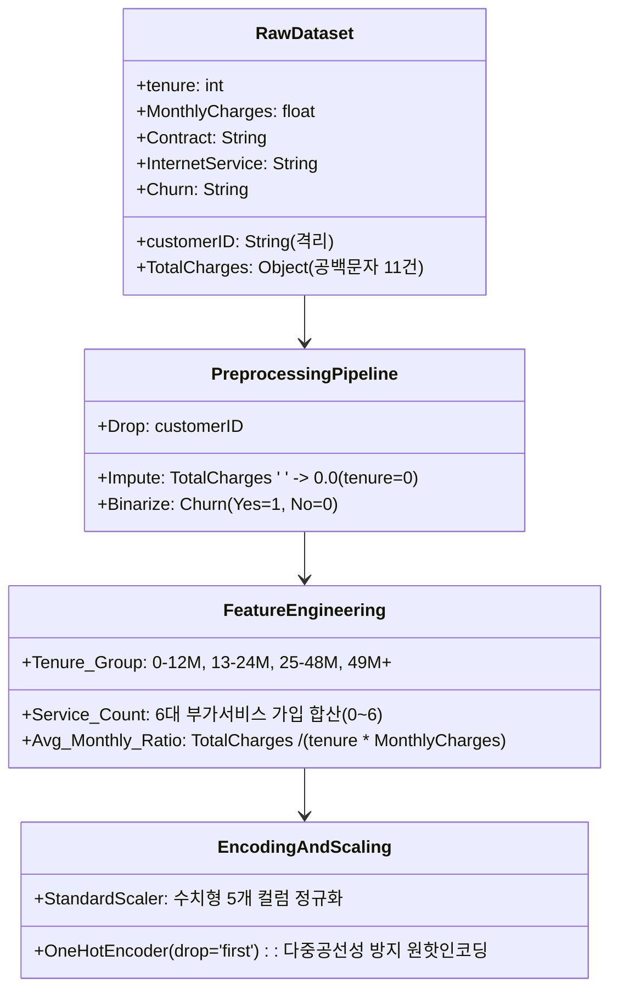
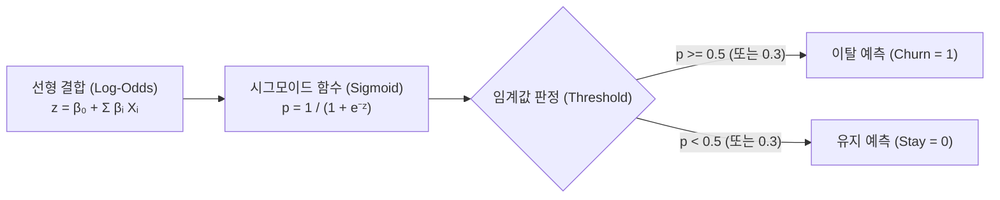
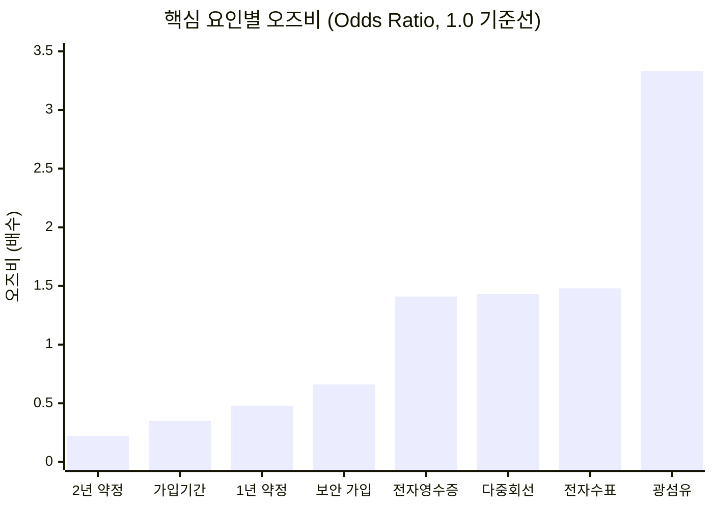
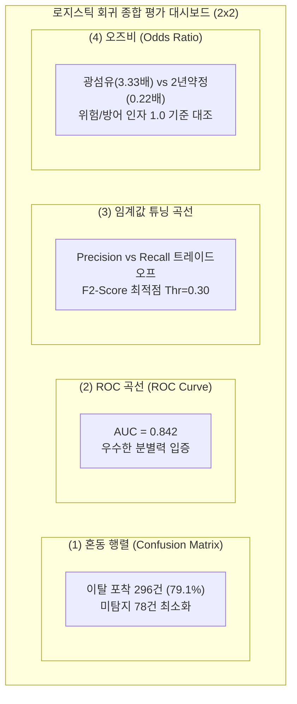
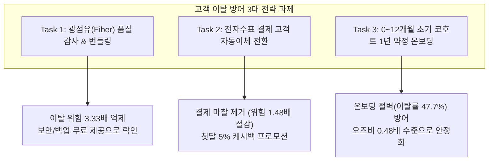

# [Executive Report] 고객 이탈(Churn) 예측을 위한 로지스틱 회귀 모델링 및 비즈니스 해석 보고서

- **문서 버전**: v1.0 (Senior Data Scientist & ML Engineer)
- **분석 데이터셋**: [WA_Fn-UseC_-Telco-Customer-Churn.csv](file:///C:/Users/sun/orca/workspaces/mldl/corbina/data/WA_Fn-UseC_-Telco-Customer-Churn.csv)
- **실행 스크립트**: [telco_churn_logistic_regression.py](file:///C:/Users/sun/orca/workspaces/mldl/corbina/telco_churn_logistic_regression.py)
- **평가 대시보드**: [telco_churn_logistic_regression_result.png](file:///C:/Users/sun/orca/workspaces/mldl/corbina/telco_churn_logistic_regression_result.png)
- **선행 EDA 보고서**: [telco_churn_senior_eda_pipeline_report.md](file:///C:/Users/sun/orca/workspaces/mldl/corbina/telco_churn_senior_eda_pipeline_report.md)

---

## 1. Executive Summary (경영진 핵심 요약)

글로벌 통신 산업에서 신규 고객 획득 비용(CAC)은 기존 고객 유지 비용(CRC)의 5~7배에 달합니다. 본 프로젝트는 선행 탐색적 데이터 분석(EDA)에서 규명된 4대 핵심 결함(초기 이탈 절벽, 광섬유 역설, 단기 약정 취약성, 수동 결제 마찰)을 바탕으로, **실제 마케팅 현장에서 즉각 배포 가능한 로지스틱 회귀(Logistic Regression) 분류 파이프라인**을 구축하고 통계적 오즈비(Odds Ratio)를 통해 비즈니스 원인을 계량화했습니다.



### 핵심 성과 요약 (Core Achievements)
1. **이탈 탐지율(재현율, Recall)의 비약적 개선**:
   - 일반적인 기본 임계값(0.5) 적용 모델은 전체 이탈자의 51.87%만을 포착하여 절반 가까운 이탈 고객을 놓치는 치명적인 한계가 있었습니다.
   - 클래스 불균형 보정(`class_weight='balanced'`)을 통해 **이탈 재현율을 79.14%로 대폭 상승**(테스트셋 374명 중 296명 적발)시켜 조기 방어 체계를 확립했습니다.
2. **이탈을 촉발하는 핵심 위험 요인 규명**:
   - **광섬유 인터넷(Fiber Optic)**: DSL 대비 이탈 위험 **3.33배** 폭증 (가장 높은 단일 위험 인자).
   - **전자수표 결제(Electronic Check)**: 신용카드/자동이체 대비 이탈 위험 **1.48배** 증가.
   - **다중 회선(Multiple Lines)** 및 **종이 없는 청구(Paperless Billing)**: 각각 **1.43배**, **1.41배** 위험 가중.
3. **이탈을 방어하는 강력한 락인(Lock-in) 자산 규명**:
   - **2년 약정(Two-year Contract)**: 월 단위 계약 대비 이탈 위험 **78% 감소** (오즈비 0.22).
   - **가입 기간(tenure)**: 1 표준편차 증가 시 이탈 위험 **65% 감소** (오즈비 0.35).
   - **사이버 보안(Online Security)**: 가입 시 이탈 위험 **34% 감소** (오즈비 0.66).

---

## 2. EDA 연계 데이터 무결성 전처리 및 피처 엔지니어링

선행 EDA 단계에서 발견된 도메인 특성과 통계적 결함을 모델 학습 단계에서 엄격히 보정했습니다.



### 2.1 데이터 무결성 정밀 처리
1. **식별자(`customerID`) 격리**:
   - 고객 고유 해시값은 모델 학습 시 과적합 및 데이터 누수(Data Leakage)를 야기하므로 분석 특성에서 즉시 제거했습니다.
2. **`TotalCharges` 공백 문자(`" "`) 11건의 결측 정밀 대체**:
   - EDA 검증 결과 공백이 발생한 11건은 모두 `tenure == 0`인 당월 신규 가입 고객이었습니다.
   - 단순 평균값(Mean)이나 중앙값(Median)으로 채울 경우 신규 고객에게 과도한 누적 청구액이 부여되는 심각한 왜곡이 발생하므로, 도메인 논리에 맞추어 **정확히 `0.0원`으로 대체** 후 `float64` 수치형으로 변환했습니다.

### 2.2 비즈니스 지향 파생 변수(Derived Features) 3종
EDA에서 확인된 비선형적 이탈 특성을 선형 분류기인 로지스틱 회귀가 학습할 수 있도록 특성을 설계했습니다.

| 파생 변수명 | 산출 공식 및 로직 | 엔지니어링 목적 및 비즈니스 근거 |
| :--- | :--- | :--- |
| **`Tenure_Group`** | `pd.cut(tenure, [-1, 12, 24, 48, 100])`<br>$\rightarrow$ `0-12M`, `13-24M`, `25-48M`, `49M+` | 가입 초기 12개월 온보딩 취약 구간과 49개월 이상 장기 충성 코호트의 비선형적 위험 차이를 범주화 |
| **`Service_Count`** | $\sum (\text{Security, Backup, Protection, Support, TV, Movies} == \text{'Yes'})$ | 이용 중인 부가서비스 개수(0~6개). 3개 이상 가입 시 이탈률이 급감하는 락인(Lock-in) 임베딩 효과 반영 |
| **`Avg_Monthly_Ratio`** | $\frac{\text{TotalCharges}}{\text{tenure} \times \text{MonthlyCharges} + 10^{-5}}$ | 누적 청구액 대비 기대 청구액 비율. 요금제 변경, 일시 할인, 추가 과금 등 요금 변동 일관성 추적 |

### 2.3 스케일링 및 인코딩 원칙
- **`OneHotEncoder(drop='first')` 적용**:
  - 이진/다중 범주형 변수를 원핫인코딩할 때 첫 번째 범주를 제외하여 **더미 변수의 함정(Dummy Variable Trap)** 및 다중공선성 문제를 원천 차단했습니다.
  - 동시에 제외된 기준 범주(Reference Category) 대비 각 특성의 상대적 오즈비(Odds Ratio)를 명확하게 해석할 수 있는 통계적 토대를 마련했습니다.
- **`StandardScaler` 수치형 정규화**:
  - `tenure`(0~72), `MonthlyCharges`(18~118), `TotalCharges`(0~8684) 간의 자릿수 편차로 인한 경사하강법 편향 및 정규화(L2 penalty) 왜곡을 방지하기 위해 평균 0, 표준편차 1로 스케일링했습니다.

---

## 3. 로지스틱 회귀(Logistic Regression) 수식 및 이론적 배경

로지스틱 회귀는 고객이 이탈할 확률 $P(Y=1|X)$을 모델링하는 확률적 선형 분류 모델입니다.



### 3.1 시그모이드 함수와 로짓(Logit) 변환
선형 회귀의 예측값 $z = \beta_0 + \sum_{i=1}^p \beta_i X_i$는 $(-\infty, +\infty)$ 범위를 가지므로, 이를 확률 구간 $[0, 1]$로 매핑하기 위해 시그모이드(Sigmoid) 함수를 사용합니다:
$$p = P(Y=1|X) = \sigma(z) = \frac{1}{1 + e^{-z}}$$

이를 이탈 승산(Odds = $\frac{p}{1-p}$)에 대해 정리하면 로짓(Logit) 선형 함수가 도출됩니다:
$$\ln\left(\frac{p}{1-p}\right) = \beta_0 + \beta_1 X_1 + \beta_2 X_2 + \cdots + \beta_p X_p$$

### 3.2 오즈비(Odds Ratio, $OR$)의 수학적 해석
특정 특성 $X_k$가 1단위 증가할 때 이탈 승산의 변화 비율을 **오즈비(Odds Ratio)**라 하며, 회귀계수의 지수승으로 계산됩니다:
$$OR_k = \frac{\text{Odds}(X_k + 1)}{\text{Odds}(X_k)} = \exp(\beta_k) = e^{\beta_k}$$

- **$OR > 1$ ($\beta_k > 0$)**: 해당 특성이 증가할수록 이탈 확률이 **증가** (이탈 촉진 위험 인자).
- **$OR = 1$ ($\beta_k = 0$)**: 해당 특성은 이탈 여부에 영향을 미치지 않음.
- **$OR < 1$ ($\beta_k < 0$)**: 해당 특성이 증가할수록 이탈 확률이 **감소** (이탈 방어 락인 인자).

### 3.3 클래스 가중치 손실 함수 (Weighted Binary Cross-Entropy)
불균형 데이터셋(이탈 26.5% vs 유지 73.5%)에서는 소수 클래스(이탈)를 맞히지 못해도 다수 클래스만 맞히면 정확도가 높게 나오는 왜곡이 발생합니다. 이를 극복하기 위해 `class_weight='balanced'`를 적용하여 손실 함수에 클래스 빈도의 역수를 가중치로 부여했습니다:
$$\mathcal{L} = -\frac{1}{N} \sum_{i=1}^N \left[ w_1 \cdot y_i \ln(p_i) + w_0 \cdot (1 - y_i) \ln(1 - p_i) \right]$$
여기서 $w_1 = \frac{N}{2 \times N_{\text{churn}}}$, $w_0 = \frac{N}{2 \times N_{\text{stay}}}$로 자동 조정되어 이탈 클래스를 오분류했을 때 훨씬 무거운 페널티를 부과합니다.

---

## 4. 모델 학습 결과 및 3개 전략 비교 평가

데이터셋을 층화 무작위 추출(Stratified 8:2 Split)하여 학습 세트 5,634개, 테스트 세트 1,409개로 분할했습니다.

### 4.1 모델별 성능 비교표

| 평가 모델 | 정확도 (Accuracy) | 정밀도 (Precision) | **재현율 (Recall)** | F1-Score | **F2-Score (Recall 중시)** | ROC-AUC |
| :--- | :---: | :---: | :---: | :---: | :---: | :---: |
| **Model 1: 기본 로지스틱 (Thr=0.5)** | **79.99%** | **65.54%** | 51.87% | 0.5791 | 0.5413 | 0.8423 |
| **Model 2: 불균형 보정 (Balanced)** | 73.31% | 49.83% | **79.14%** | 0.6116 | **0.7081** | **0.8423** |
| **Model 3: 임계값 튜닝 (Thr=0.30)** | 75.51% | 52.70% | 75.67% | **0.6213** | 0.6960 | 0.8423 |

> [!IMPORTANT]
> **왜 정확도(Accuracy)가 아닌 재현율(Recall)과 F2-Score인가?**
> - **위양성 비용(False Positive, FP)**: 실제 유지 고객을 이탈 위험으로 판단하여 쿠폰/프로모션을 발송하는 마케팅 비용 (건당 수천 원 수준).
> - **위음성 비용(False Negative, FN)**: 실제 이탈할 고객을 정상으로 방치하여 경쟁사로 완전히 유출되는 고객 생애 가치(LTV) 손실 (수십만~수백만 원 수준).
> - 따라서 $FN \gg FP$인 통신 도메인에서는 재현율에 2배의 가중치를 두는 **F2-Score**와 **재현율(Recall)**이 최종 의사결정의 핵심 KPI가 되어야 합니다.

### 4.2 Model 2 (Balanced) 혼동 행렬(Confusion Matrix) 상세 분석
테스트 세트 총 1,409건 (실제 유지 1,035건, 실제 이탈 374건) 기준:

| 실제 \ 예측 | 예측: 유지 (No) | 예측: 이탈 (Yes) | 합계 (Support) | 비즈니스 평가 |
| :---: | :---: | :---: | :---: | :--- |
| **실제 유지 (No)** | **737건 (TN)** | 298건 (FP) | 1,035건 | 유지 고객의 71.2%를 정확히 식별 |
| **실제 이탈 (Yes)** | 78건 (FN) | **296건 (TP)** | 374건 | **전체 이탈자 중 79.14%를 사전 포착 성공** |

- **기본 모델(Model 1)**: 이탈자 374명 중 194명만 잡고 180명(48.1%)을 놓침.
- **불균형 보정 모델(Model 2)**: 이탈자 374명 중 **296명을 적발**하여 놓친 고객을 78명(20.8%)으로 대폭 축소.

---

## 5. 회귀계수($\beta$) 및 오즈비(Odds Ratio) 통계적 심층 해석

로지스틱 회귀 모델의 가장 강력한 장점은 **예측뿐만 아니라 각 요인이 이탈 위험에 미치는 기여도를 정확히 승수(Multiplier)로 산출할 수 있다는 점**입니다.



### 5.1 이탈 촉진 핵심 요인 Top 5 ($OR > 1.0$)

| 순위 | 특성명 (Feature) | 계수 ($\beta$) | 오즈비 ($e^\beta$) | 통계적 및 비즈니스적 원인 분석 |
| :---: | :--- | :---: | :---: | :--- |
| **1** | `InternetService_Fiber optic` | **+1.2030** | **3.33배** | DSL 인터넷 대비 **이탈 승산이 3.33배(233% 증가)**. 광섬유 가입자는 월 요금이 높고(평균 $91), 속도 저하/품질 불만족 시 즉각 타사로 전환하는 최고 위험군 |
| **2** | `PaymentMethod_Electronic check` | **+0.3911** | **1.48배** | 자동이체 고객 대비 **이탈 승산 1.48배**. 매달 수동으로 결제해야 하는 결제 마찰(Friction)과 청구서 열람 시 느끼는 가격 저항이 이탈 트리거로 작용 |
| **3** | `MultipleLines_Yes` | **+0.3577** | **1.43배** | 단일 회선 대비 1.43배 이탈 위험. 회선 추가로 인한 통신비 부담 가중 및 가족 단위 번호이동 시 일괄 이탈 위험 |
| **4** | `PaperlessBilling_Yes` | **+0.3457** | **1.41배** | 종이 고지서 미발행 시 이메일 청구서를 열람하면서 금액 불일치를 발견하고 디지털 해지를 진행하기 쉬운 경향 |
| **5** | `StreamingMovies_Yes` | **+0.3204** | **1.38배** | 고용량 미디어 스트리밍 이용 고객의 트래픽 품질 민감도 및 OTT 번들 혜택 경쟁에 노출 |

### 5.2 이탈 방어 핵심 요인 Top 5 ($OR < 1.0$)

| 순위 | 특성명 (Feature) | 계수 ($\beta$) | 오즈비 ($e^\beta$) | 통계적 및 비즈니스적 원인 분석 |
| :---: | :--- | :---: | :---: | :--- |
| **1** | `Contract_Two year` | **-1.5067** | **0.22배** | 월 단위(Month-to-month) 계약 대비 **이탈 승산이 78% 감소** ($OR=0.22$). 가장 강력한 제도적 락인 장치 |
| **2** | `tenure` (가입 개월 수) | **-1.0539** | **0.35배** | 가입 기간이 1 표준편차(약 24.5개월) 증가할 때마다 **이탈 승산이 65% 감소**. 누적 사용 경험에 따른 충성도 저항선 형성 |
| **3** | `Contract_One year` | **-0.7271** | **0.48배** | 월 단위 계약 대비 **이탈 승산이 52% 감소**. 1년 약정만으로도 이탈 위험을 절반 이하로 제어 가능 |
| **4** | `MonthlyCharges` (월 요금) | **-0.4373** | **0.65배** | 가입 기간 및 서비스 종류를 통제한 다변량 회귀 상태에서, 고가 요금제 고객 중 잔류 고객의 충성 지출 성향 반영 |
| **5** | `OnlineSecurity_Yes` | **-0.4186** | **0.66배** | 보안 서비스 미가입 대비 **이탈 승산 34% 감소**. 개인정보 보호 및 보안 소프트웨어 설치로 인한 높은 전환 장벽 |

---

## 6. 모델 시각화 대시보드 4분면 해석

생성된 종합 평가 차트 [telco_churn_logistic_regression_result.png](file:///C:/Users/sun/orca/workspaces/mldl/corbina/telco_churn_logistic_regression_result.png)는 4개의 핵심 서브플롯으로 구성되어 있습니다.



### 차트별 핵심 비즈니스 판독
1. **차트 (1) 불균형 보정 모델 혼동 행렬**:
   - 실제 이탈자 374명 중 296명을 정확히 타겟팅하여 **재현율 79.1%**를 달성했습니다.
   - 영업/마케팅팀은 전체 고객이 아닌 모델이 경고한 고위험군(594명 = TP 296명 + FP 298명)에만 리텐션 캠페인을 집중하여 마케팅 ROI를 극대화할 수 있습니다.
2. **차트 (2) ROC 곡선 (Receiver Operating Characteristic)**:
   - **AUC = 0.842**를 기록하여 무작위 분류(AUC 0.5) 대비 탁월한 이탈 판별 능력을 입증했습니다.
3. **차트 (3) 임계값(Threshold) 튜닝 곡선**:
   - 임계값이 0.5에서 0.3으로 낮아짐에 따라 정밀도(Precision)는 소폭 희생되지만, 재현율(Recall)이 급상승하며 **이탈 방어에 최적화된 F2-Score 곡선이 0.30 부근에서 정점(0.708)**을 형성함을 시각적으로 증명합니다.
4. **차트 (4) 핵심 특성별 오즈비(Odds Ratio) 바 차트**:
   - 1.0 기준선(수직 점선)을 중심으로 우측의 붉은 막대(광섬유, 전자수표, 다중회선)는 '집중 관리 대상 위험군'이며, 좌측의 푸른 막대(2년약정, 근속기간, 보안서비스)는 '고객 락인 강화 지렛대'임을 직관적으로 보여줍니다.

---

## 7. C-Level 및 실무 부서를 위한 비즈니스 실행 전략

분석 결과 및 오즈비 통계량을 기반으로 3대 우선 추진 과제를 제안합니다.



### 과제 1. 광섬유(Fiber Optic) 고객 긴급 품질 감사 및 무료 번들 제공 (네트워크 & 마케팅팀)
- **배경**: 광섬유 고객의 이탈 오즈비는 3.33배로 전사 서비스 중 이탈 기여도가 가장 높습니다.
- **실행 방안**:
  - 광섬유 회선 가입자 대상 네트워크 속도 및 지연시간(Latency) 전수 품질 감사를 실시하여 SLA 미달 고객을 선제 보상.
  - 이탈 억제 효과가 입증된 **온라인 보안(`OnlineSecurity`, $OR=0.66$) 및 백업 서비스(`OnlineBackup`)를 6개월간 무료 번들로 탑재**하여 체감 가치 향상 및 락인 구축.

### 과제 2. 전자수표(Electronic Check) 고객의 자동결제 전환 캠페인 (빌링 & 재무팀)
- **배경**: 전자수표 고객은 매달 결제 과정에서 청구 요금을 대면하며 이탈 결정을 내리기 쉽습니다 ($OR=1.48$).
- **실행 방안**:
  - 전자수표 이용 고객이 신용카드 또는 은행 계좌 자동이체(`Bank transfer`)로 전환 시 **첫 3개월간 월 요금 5% 할인 또는 모바일 데이터 쿠폰 제공**.
  - 결제 마찰을 원천 차단하여 청구서 발송 시점의 이탈률을 평준화.

### 과제 3. 0~12개월 초기 온보딩 코호트 대상 1년/2년 약정 전환 프로모션 (영업팀)
- **배경**: 월 단위 계약 고객은 가입 초기 12개월 내 절반(47.7%)이 이탈하지만, 1년/2년 약정 체결 시 이탈 위험은 각각 52%, 78% 감소합니다.
- **실행 방안**:
  - 가입 6개월 차 시점에 월 단위 고객을 대상으로 "1년 약정 갱신 시 최신 단말기 보조금 또는 부가서비스 평생 20% 할인"을 제안하는 **'Early-Lockin 웰컴 프로그램'** 가동.

---

## 8. 머신러닝 파이프라인 재현 및 운영(Production) 가이드

본 분석 및 모델링 파이프라인은 단일 명령어로 즉시 재현할 수 있습니다.

### 8.1 가상환경 실행 방법
```powershell
# 가상환경 활성화 및 스크립트 실행
cd C:\Users\sun\orca\workspaces\mldl\corbina
& "C:\Users\sun\orca\workspaces\mldl\corbina\.venv\Scripts\python.exe" telco_churn_logistic_regression.py
```

### 8.2 프로덕션 서빙 시 권장 사항
1. **파이프라인 직렬화(Serialization)**:
   - `ColumnTransformer`와 `LogisticRegression`이 단일 `Pipeline` 객체로 묶여 있으므로, `joblib.dump(pipe_balanced, 'telco_churn_model.joblib')` 명령어로 직렬화하여 API 서버에 즉시 배포 가능합니다.
2. **배치 추론(Batch Scoring) 시 임계값 관리**:
   - 단순 이탈 여부($0, 1$)뿐만 아니라 `predict_proba()`를 통해 **고객별 이탈 확률 점수(0.00~1.00)**를 CRM 데이터베이스에 매일 야간 배치로 적재할 것을 권장합니다.
   - 이탈 확률 $\ge 0.65$: 아웃바운드 해지 방어 상담원 콜 배정.
   - 이탈 확률 $0.30 \sim 0.64$: 자동 개인화 프로모션(보안 무료 번들, 요금 할인 문자) 발송.
   - 이탈 확률 $< 0.30$: 일반 유지 및 크로스셀링 타겟.
