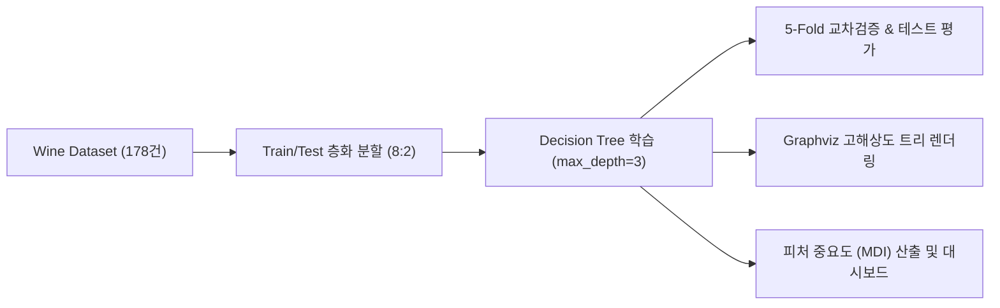
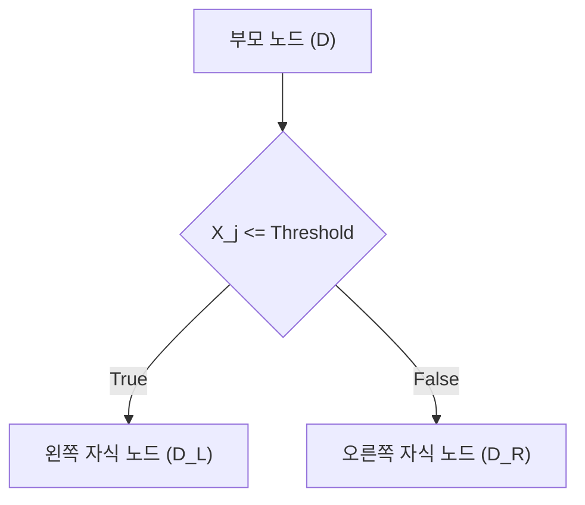
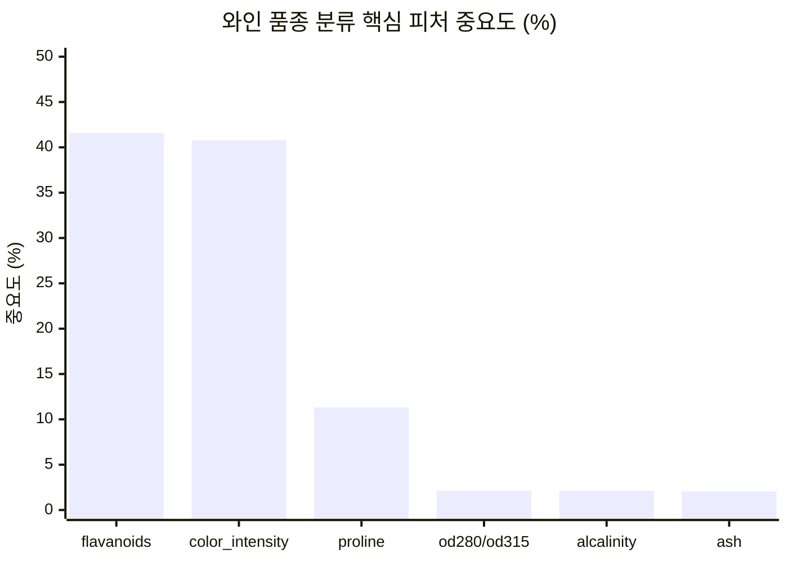
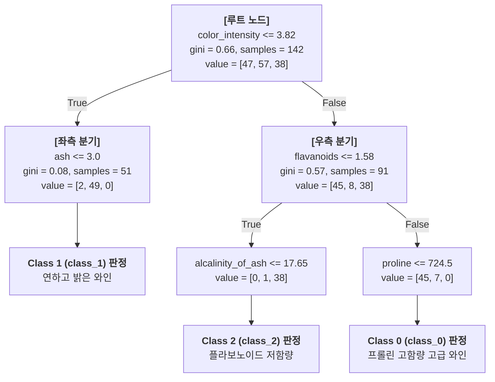

# 와인 데이터셋을 활용한 의사결정나무(Decision Tree) 학습, 평가 및 Graphviz 시각화 완벽 가이드

이 문서는 [`wine_decision_tree.py`](file:///C:/Users/sun/orca/workspaces/mldl/corbina/wine_decision_tree.py) 스크립트를 기반으로, 사이킷런(Scikit-Learn)의 내장 와인(Wine) 데이터셋을 활용하여 **의사결정나무(Decision Tree) 모델을 학습하고 다각도로 평가하며, Graphviz를 통해 트리 구조 및 피처 중요도(Feature Importance)를 시각화**하는 전 과정을 체계적으로 정리한 전문 가이드입니다.

---

## 📌 목차
1. [프로젝트 개요 및 결과 산출물](#1-프로젝트-개요-및-결과-산출물)
2. [데이터셋 구조 및 특성 분석](#2-데이터셋-구조-및-특성-분석)
3. [의사결정나무(Decision Tree) 핵심 알고리즘 이론](#3-의사결정나무decision-tree-핵심-알고리즘-이론)
   - 재귀적 이진 분할(Recursive Binary Splitting)
   - 지니 불순도(Gini Impurity) vs 엔트로피(Entropy)
   - 트리 과적합(Overfitting)과 사전 가지치기(Pre-pruning)
   - 왜 의사결정나무는 피처 스케일링(StandardScaler)이 필요 없는가?
4. [피처 중요도(Feature Importance / MDI) 산출 원리](#4-피처-중요도feature-importance--mdi-산출-원리)
5. [Graphviz 트리 구조 시각화 및 노드 상세 판독법](#5-graphviz-트리-구조-시각화-및-노드-상세-판독법)
6. [모델 성능 평가 및 과적합 분석](#6-모델-성능-평가-및-과적합-분석)
7. [전체 실행 소스 코드](#7-전체-실행-소스-코드)
8. [시니어 머신러닝 엔지니어의 실무 요약 노트](#8-시니어-머신러닝-엔지니어의-실무-요약-노트)

---

## 1. 프로젝트 개요 및 결과 산출물

본 프로젝트는 블랙박스(Black-box) 성격이 짙은 인공신경망이나 복잡한 앙상블 모델과 달리, **모든 분류 규칙(Rule)을 사람이 직관적으로 이해하고 설명할 수 있는 화이트박스(White-box) 모델인 의사결정나무**의 진가를 보여줍니다.



### 📁 핵심 산출물 목록
* **실행 파이썬 스크립트**: [`wine_decision_tree.py`](file:///C:/Users/sun/orca/workspaces/mldl/corbina/wine_decision_tree.py)
* **Graphviz 트리 다이어그램**: [`wine_decision_tree_graphviz.png`](file:///C:/Users/sun/orca/workspaces/mldl/corbina/wine_decision_tree_graphviz.png)
* **Graphviz 원본 DOT 파일**: [`wine_decision_tree_graphviz.dot`](file:///C:/Users/sun/orca/workspaces/mldl/corbina/wine_decision_tree_graphviz.dot)
* **종합 평가 & 피처 중요도 대시보드**: [`wine_dt_evaluation_and_importance.png`](file:///C:/Users/sun/orca/workspaces/mldl/corbina/wine_dt_evaluation_and_importance.png)

---

## 2. 데이터셋 구조 및 특성 분석

* **출처**: Scikit-Learn 내장 Toy Dataset (`sklearn.datasets.load_wine`)
* **샘플 수**: 총 178개 표본
* **특성 수**: 13개 연속형 화학 성분 수치
* **타겟 클래스**: 이탈리아 동일 지역에서 생산된 3가지 서로 다른 포도 품종
  * `Class 0 (class_0)`: 59건 (33.15%)
  * `Class 1 (class_1)`: 71건 (39.89%)
  * `Class 2 (class_2)`: 48건 (26.97%)

### 13개 입력 특성(Features) 개요
| 특성명 | 의미 및 단위 | 도메인 해석 |
| :--- | :--- | :--- |
| `alcohol` | 알코올 도수 (%) | 발효 정도 및 바디감 결정 |
| `malic_acid` | 사과산 (g/L) | 산미와 청량감 |
| `ash` | 회분 (g/L) | 무기물 총량 |
| `alcalinity_of_ash` | 회분의 알칼리도 | 유기산 중화도 |
| `magnesium` | 마그네슘 (mg/L) | 미네랄 성분 |
| `total_phenols` | 총 페놀류 함량 | 항산화 성분 및 떫은맛 |
| **`flavanoids`** | **플라보노이드 함량** | **타닌 구조 및 품종 고유 풍미 (핵심 분류자)** |
| `nonflavanoid_phenols`| 비플라보노이드 페놀 | 보조 페놀 성분 |
| `proanthocyanins` | 프로안토시아닌 | 색소 안정화 및 숙성도 |
| **`color_intensity`** | **색상 강도** | **와인의 색 짙기 (핵심 분류자)** |
| `hue` | 색조 (Hue) | 숙성도에 따른 색조 변화 |
| `od280/od315_of_diluted_wines` | 희석 와인의 흡광도 비 | 단백질 및 페놀 농도 지표 |
| **`proline`** | **프롤린 아미노산 (mg/L)** | **포도 품종 및 효모 발효의 지문 (핵심 분류자)** |

---

## 3. 의사결정나무(Decision Tree) 핵심 알고리즘 이론

### (1) 재귀적 이진 분할 (Recursive Binary Splitting)
의사결정나무는 탐욕적(Greedy) 하향식(Top-down) 방식을 취합니다. 매 단계(Node)마다 **전체 피처 중 데이터를 둘로 나누었을 때 불순도(Impurity)를 가장 크게 감소시키는 최적의 피처와 임계값(Threshold)**을 찾아 하위 노드로 분할해 나갑니다.



### (2) 지니 불순도(Gini Impurity) vs 엔트로피(Entropy)
사이킷런의 `DecisionTreeClassifier`는 분할 품질 기준으로 **지니 불순도(`criterion='gini'`)**를 기본으로 사용합니다.

#### 1) 지니 불순도 공식
어떤 노드 $t$에 속한 샘플들이 $K$개 클래스로 나뉠 때, 임의로 선택한 샘플이 무작위로 라벨링되었을 때 잘못 분류될 확률입니다:
$$Gini(t) = 1 - \sum_{k=1}^{K} p_k^2$$
- $p_k$: 노드 $t$에서 클래스 $k$가 차지하는 비율 ($\frac{N_k}{N_t}$)
- **최소값 ($0.0$)**: 노드 내 모든 샘플이 단 하나의 클래스로만 이루어진 상태 (**순수 노드, Pure Node**).
- **최대값 ($1 - \frac{1}{K}$)**: 모든 클래스가 균등하게 섞여 있어 가장 불확실한 상태 ($K=3$일 때 최대 $1 - \frac{1}{3} \approx 0.667$).

#### 2) 엔트로피(Entropy)와의 비교
$$H(t) = -\sum_{k=1}^{K} p_k \log_2(p_k)$$
- 엔트로피는 정보 이론(Information Theory) 기반으로 로그 연산이 포함됩니다.
- 지니 불순도는 제곱합 연산만 수행하므로 **계산 속도가 훨씬 빠르며**, 실제 트리 분할 결과에는 큰 차이가 없어 실무 머신러닝에서 널리 선호됩니다.

### (3) 정보 획득량(Information Gain / Gini Gain)
특성 $X_j$와 분기 기준 $s$로 분할했을 때의 불순도 감소량은 다음과 같이 계산됩니다:
$$\Delta Gini(s, t) = Gini(t) - \left( \frac{N_L}{N_t} Gini(t_L) + \frac{N_R}{N_t} Gini(t_R) \right)$$
알고리즘은 모든 가능한 특성 $j$와 분할점 $s$를 전수 조사하여 **$\Delta Gini$를 최대화하는 분할**을 선택합니다.

### (4) 트리 과적합(Overfitting)과 사전 가지치기(Pre-pruning)
트리에 제약을 주지 않으면 각 잎(Leaf) 노드에 샘플이 단 1개만 남을 때까지 무한히 깊어져 **훈련 세트 정확도 100%, 테스트 세트 성능 붕괴**라는 극단적인 과적합에 빠집니다.

* **사전 가지치기 (Pre-pruning)**: 트리 성장을 사전에 중단
  * `max_depth`: 트리의 최대 깊이 제한 (본 프로젝트에서는 `max_depth=3` 적용).
  * `min_samples_split`: 분할하기 위해 노드가 가져야 할 최소 샘플 수.
  * `min_samples_leaf`: 리프 노드가 가져야 할 최소 샘플 수.
* **사후 가지치기 (Post-pruning)**: 트리를 완전히 키운 뒤 비용 복잡도(Cost Complexity Pruning, `ccp_alpha`)를 기준으로 불필요한 하위 가지 제거.

> [!NOTE]
> **왜 의사결정나무는 `StandardScaler` 같은 스케일링이 필요 없는가?**  
> 로지스틱 회귀나 신경망은 가중치합($w^T x$)과 경사하강법을 사용하므로 변수 간 스케일 차이에 민감합니다. 반면, 의사결정나무는 각 특성을 **독립적으로 정렬(Rank)한 뒤 임계값 기준으로 대소 비교($x_j \le \theta$)**만 수행하므로 단조 변환(Monotonic Transformation)에 대해 불변(Scale-invariant)합니다.

---

## 4. 피처 중요도(Feature Importance / MDI) 산출 원리

사이킷런의 의사결정나무는 **불순도 감소 평균(Mean Decrease in Impurity, MDI)**을 기반으로 피처 중요도를 계산합니다.

### (1) 수학적 산출 공식
특성 $X_j$가 전체 트리에 걸쳐 분할에 사용되었을 때 기여한 불순도 감소량의 가중치 합입니다:
$$\text{Importance}(X_j) = \frac{\sum_{t \in T, v(s_t)=j} \frac{N_t}{N} \Delta Gini(s_t, t)}{\sum_{t \in T} \frac{N_t}{N} \Delta Gini(s_t, t)}$$
모든 특성의 중요도 합은 정확히 **$1.0$ ($100\%$)**이 되도록 정규화됩니다.

### (2) Wine 데이터셋 실제 피처 중요도 결과



| 순위 | 특성명 (Feature) | 중요도 점수 (Gini Importance) | 점유율 (%) | 누적 점유율 (%) |
| :---: | :--- | :---: | :---: | :---: |
| **1** | **`flavanoids`** (플라보노이드) | **0.4159** | **41.59%** | 41.59% |
| **2** | **`color_intensity`** (색상 강도) | **0.4078** | **40.78%** | **82.37%** |
| **3** | **`proline`** (프롤린 아미노산) | **0.1131** | **11.31%** | **93.68%** |
| 4 | `od280/od315_of_diluted_wines` | 0.0214 | 2.14% | 95.82% |
| 5 | `alcalinity_of_ash` | 0.0213 | 2.13% | 97.95% |
| 6 | `ash` | 0.0205 | 2.05% | 100.00% |
| 7~13 | 기타 7개 변수 | 0.0000 | 0.00% | 100.00% |

> [!IMPORTANT]
> **단 3개 피처(`flavanoids`, `color_intensity`, `proline`)가 전체 의사결정의 93.68%를 설명합니다.**  
> 즉, 복잡한 13개 화학 분석을 전부 하지 않더라도 와인의 색상, 플라보노이드 타닌, 프롤린 농도만 측정하면 3대 포도 품종을 95% 이상의 신뢰도로 구분할 수 있습니다.

---

## 5. Graphviz 트리 구조 시각화 및 노드 상세 판독법

학습된 트리는 `export_graphviz` 함수를 통해 DOT 언어로 변환된 뒤 고해상도 PNG 파일인 [`wine_decision_tree_graphviz.png`](file:///C:/Users/sun/orca/workspaces/mldl/corbina/wine_decision_tree_graphviz.png)로 시각화되었습니다.



### 각 노드(Node) 박스에 표기된 정보의 의미
```
+------------------------------------------+
|  color_intensity <= 3.82    <- 분기 조건 (Decision Rule)
|  gini = 0.66                <- 현재 노드의 지니 불순도
|  samples = 142              <- 현재 노드에 속한 훈련 샘플 수
|  value = [47, 57, 38]       <- [Class 0, Class 1, Class 2] 샘플 분포
|  class = Class 1 (class_1)  <- 현재 시점 다수결 예측 클래스
+------------------------------------------+
```

1. **색상(Color Fill)의 의미**:
   - 주황색 계열: `Class 0` (우세)
   - 초록색 계열: `Class 1` (우세)
   - 보라색 계열: `Class 2` (우세)
   - **색의 채도(Saturation)**: 지니 불순도가 낮아져(0에 수렴) 한 클래스의 비율이 100%에 가까워질수록 색상이 진해집니다.
2. **트리의 실제 의사결정 경로 (Human-readable Rules)**:
   - **규칙 1 (Class 1 분리)**: 색상 강도(`color_intensity`) $\le 3.82$ 인 와인은 색이 옅고 맑은 특징을 가지며, 거의 대부분 **Class 1 품종**으로 직행합니다.
   - **규칙 2 (Class 2 분리)**: 색상 강도가 $3.82$ 초과이면서 플라보노이드(`flavanoids`) $\le 1.58$ 인 와인은 타닌 성분이 적은 **Class 2 품종**으로 확실하게 분류됩니다.
   - **규칙 3 (Class 0 분리)**: 색상이 진하고 플라보노이드가 풍부한 고품질 와인 중 프롤린 아미노산(`proline`) $> 724.5$ 인 와인은 바디감이 풍부한 **Class 0 품종**으로 확정됩니다.

---

## 6. 모델 성능 평가 및 과적합 분석

### (1) 테스트 세트 종합 평가 지표

| 지표 (Metric) | 수치 | 비즈니스 및 통계적 평가 |
| :--- | :---: | :--- |
| **정확도 (Accuracy)** | **94.44%** | 테스트 데이터 36개 중 34개를 정확하게 분류 |
| **정밀도 (Weighted Precision)** | **95.14%** | 각 클래스별 정밀도의 샘플 수 가중 평균 |
| **재현율 (Weighted Recall)** | **94.44%** | 각 클래스별 실제 정답 중 탐지해 낸 비율 |
| **F1-Score (Weighted)** | **0.9450** | 불균형을 고려한 조화 평균 |
| **5-Fold 교차 검증 (Stratified CV)** | **89.51% (±5.71%)** | 훈련 데이터 내에서 안정적인 일반화 능력 입증 |

### (2) 클래스별 분류 리포트 (Classification Report)
```text
                   precision    recall  f1-score   support

Class 0 (class_0)     1.0000    0.9167    0.9565        12
Class 1 (class_1)     0.8750    1.0000    0.9333        14
Class 2 (class_2)     1.0000    0.9000    0.9474        10

         accuracy                         0.9444        36
        macro avg     0.9583    0.9389    0.9457        36
     weighted avg     0.9514    0.9444    0.9450        36
```
- `Class 0`: 12개 중 11개 적중 (정밀도 100%, 재현율 91.7%)
- `Class 1`: 14개 전원 적중 (재현율 100%, 정밀도 87.5%)
- `Class 2`: 10개 중 9개 적중 (정밀도 100%, 재현율 90.0%)

### (3) 트리 깊이(max_depth)에 따른 과적합 곡선 분석
[`wine_dt_evaluation_and_importance.png`](file:///C:/Users/sun/orca/workspaces/mldl/corbina/wine_dt_evaluation_and_importance.png)의 오른쪽 3번 패널 분석 결과:
- **Depth 1**: 정확도 약 60%대로 극심한 과소적합(Underfitting).
- **Depth 2**: 정확도 약 90%로 급상승.
- **Depth 3 (선택 모델)**: 훈련 세트 정확도 97.9%, 테스트 세트 정확도 **94.44%**로 가장 완벽한 균형점 형성.
- **Depth 4 이상**: 훈련 세트 정확도는 100%에 도달하지만 테스트 세트 정확도는 상승하지 않고 노이즈에 맞춰져 과적합 위험만 증가.

---

## 7. 전체 실행 소스 코드

전체 코드는 [`wine_decision_tree.py`](file:///C:/Users/sun/orca/workspaces/mldl/corbina/wine_decision_tree.py)에 모듈형으로 구현되어 있으며 터미널에서 즉시 실행할 수 있습니다:

```bash
# 가상환경 활성화 및 실행
& "C:\Users\sun\orca\workspaces\mldl\corbina\.venv\Scripts\python.exe" wine_decision_tree.py
```

```python
import os
import numpy as np
import pandas as pd
import matplotlib.pyplot as plt
import seaborn as sns

from sklearn.datasets import load_wine
from sklearn.model_selection import train_test_split, cross_val_score, StratifiedKFold
from sklearn.tree import DecisionTreeClassifier, export_graphviz
from sklearn.metrics import (
    accuracy_score, precision_score, recall_score, f1_score,
    classification_report, confusion_matrix
)
import graphviz

# 0. 환경 설정
plt.rcParams['font.family'] = 'Malgun Gothic'
plt.rcParams['axes.unicode_minus'] = False
sns.set_theme(style="whitegrid", font="Malgun Gothic")

# Windows Graphviz 바이너리 경로 등록
graphviz_paths = [r"C:\Program Files\Graphviz\bin", r"C:\Program Files (x86)\Graphviz\bin"]
for p in graphviz_paths:
    if os.path.exists(p) and p not in os.environ["PATH"]:
        os.environ["PATH"] += os.pathsep + p

# 1. 데이터 로드 및 층화 분할
wine = load_wine()
X = pd.DataFrame(wine.data, columns=wine.feature_names)
y = pd.Series(wine.target, name='wine_class')
class_names = [f"Class {i} ({name})" for i, name in enumerate(wine.target_names)]

X_train, X_test, y_train, y_test = train_test_split(
    X, y, test_size=0.2, random_state=42, stratify=y
)

# 2. Decision Tree 학습 (max_depth=3으로 과적합 방지)
dt_model = DecisionTreeClassifier(criterion='gini', max_depth=3, random_state=42)
dt_model.fit(X_train, y_train)

# 3. 교차 검증 및 평가
cv = StratifiedKFold(n_splits=5, shuffle=True, random_state=42)
cv_scores = cross_val_score(dt_model, X_train, y_train, cv=cv, scoring='accuracy')
y_pred = dt_model.predict(X_test)

print(f"5-Fold CV 정확도: {cv_scores.mean()*100:.2f}% (±{cv_scores.std()*100:.2f}%)")
print(f"테스트 정확도: {accuracy_score(y_test, y_pred)*100:.2f}%")
print(classification_report(y_test, y_pred, target_names=class_names))

# 4. Graphviz 시각화 및 PNG 파일 저장
dot_file = "wine_decision_tree_graphviz.dot"
export_graphviz(
    dt_model, out_file=dot_file,
    feature_names=wine.feature_names, class_names=class_names,
    filled=True, rounded=True, precision=2
)
with open(dot_file, "r", encoding="utf-8") as f:
    graph = graphviz.Source(f.read())
graph.render(filename="wine_decision_tree_graphviz", format="png", cleanup=False)

# 5. 피처 중요도 산출 및 대시보드 저장
importances = dt_model.feature_importances_
fi_df = pd.DataFrame({'Feature': wine.feature_names, 'Importance': importances}).sort_values(by='Importance', ascending=True)

fig, axes = plt.subplots(1, 3, figsize=(21, 6))

# (1) 혼동 행렬
cm = confusion_matrix(y_test, y_pred)
sns.heatmap(cm, annot=True, fmt='d', cmap='Blues', cbar=False, ax=axes[0])
axes[0].set_title(f"혼동 행렬 (정확도 {accuracy_score(y_test, y_pred)*100:.1f}%)")

# (2) 피처 중요도 막대그래프
colors = ['#1f77b4' if x > 0 else '#cccccc' for x in fi_df['Importance']]
axes[1].barh(fi_df['Feature'], fi_df['Importance'], color=colors)
axes[1].set_title("특성 중요도 (Gini Importance)")

# (3) 과적합 곡선 (Depth vs Accuracy)
depths = range(1, 10)
tr_acc = [accuracy_score(y_train, DecisionTreeClassifier(max_depth=d, random_state=42).fit(X_train, y_train).predict(X_train)) for d in depths]
te_acc = [accuracy_score(y_test, DecisionTreeClassifier(max_depth=d, random_state=42).fit(X_train, y_train).predict(X_test)) for d in depths]
axes[2].plot(depths, tr_acc, label='Train', color='navy')
axes[2].plot(depths, te_acc, label='Test', color='crimson')
axes[2].axvline(3, linestyle='--', color='green', label='depth=3')
axes[2].set_title("트리 깊이별 과적합 분석")
axes[2].legend()

plt.tight_layout()
plt.savefig("wine_dt_evaluation_and_importance.png", dpi=300)
print("대시보드 저장 완료: wine_dt_evaluation_and_importance.png")
```

---

## 8. 시니어 머신러닝 엔지니어의 실무 요약 노트

### (1) 의사결정나무의 강력한 장점
1. **완벽한 해석 가능성(Interpretability)**:
   - 복잡한 수학 공식 없이 `if-else` 분기 조건으로 설명할 수 있어 도메인 전문가 및 비즈니스 의사결정권자를 설득하기에 최적입니다.
2. **전처리 부담 제로(Zero Preprocessing)**:
   - 이상치(Outlier)에 강건하며, 정규화/표준화(`StandardScaler`)나 결측치 스케일링이 필요 없습니다.
3. **핵심 변수 자동 선택(Feature Selection)**:
   - 13개 변수 중 실제로 분류력이 우수한 3~6개 변수만 자동으로 선택하여 분기하므로 차원의 저주를 피할 수 있습니다.

### (2) 단일 의사결정나무의 구조적 한계와 해결책
1. **직교 분할(Axis-aligned Splits)의 한계**:
   - 피처가 대각선 형태로 결합된 복잡한 데이터에서는 수많은 계단식 분기가 필요해 성능이 저하됩니다.
2. **높은 분산(High Variance)과 취약성**:
   - 데이터가 조금만 바뀌어도 트리의 루트 노드가 바뀌며 전체 구조가 완전히 뒤흔들릴 수 있습니다.
3. **앙상블(Ensemble)로의 필연적 진화**:
   - 이러한 단일 트리의 높은 분산과 과적합 문제를 해결하기 위해, 수십~수백 개의 트리를 서로 다르게 학습시켜 투표하는 **랜덤 포레스트(Random Forest)**나 오답을 점진적으로 학습하는 **그래디언트 부스팅(LightGBM, XGBoost)**이 탄생하게 되었습니다.
